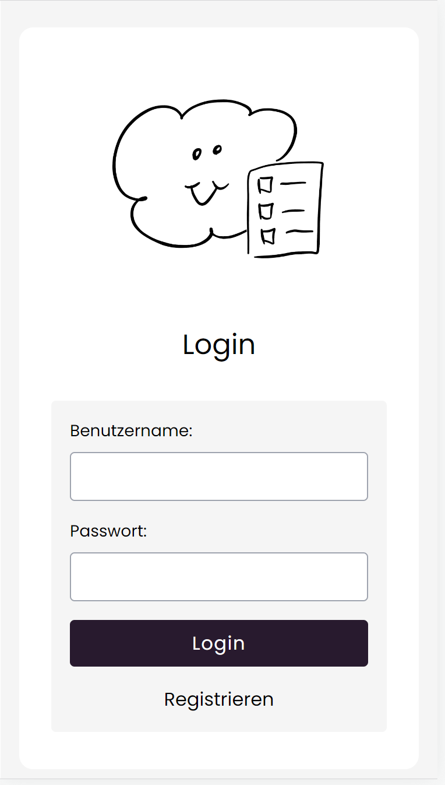
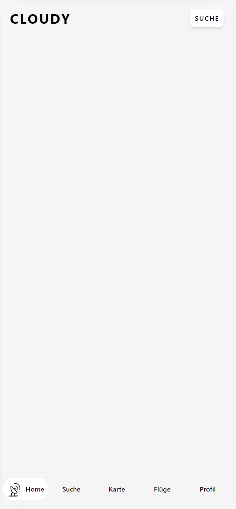
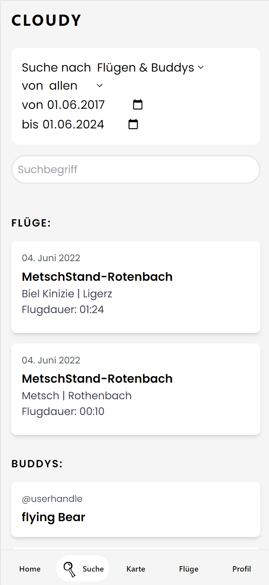
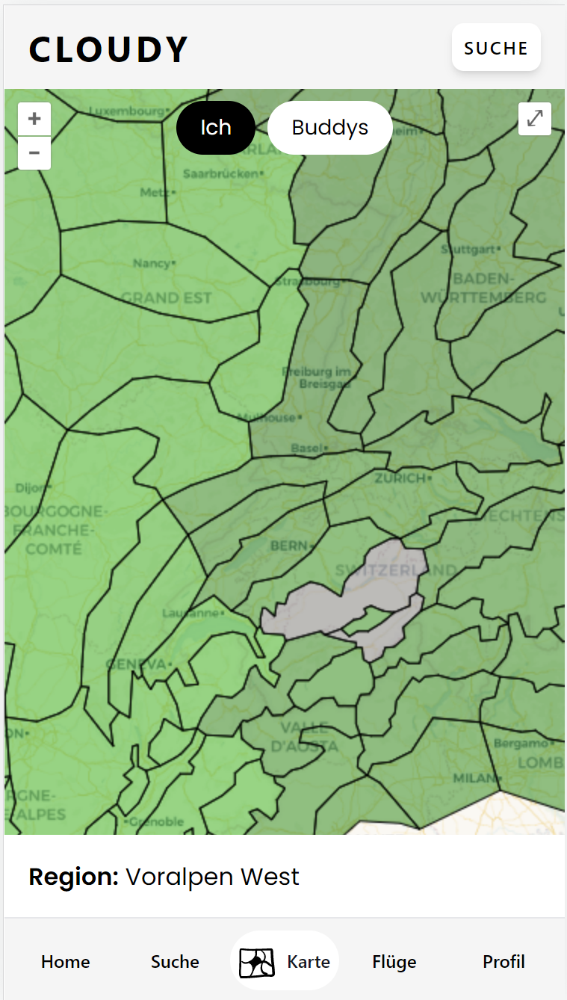

# Gleitschirm Social Media App

Das ist die Projekt Website des Gleitschirm Social Media Apps. In dem beschriebenen Repository sind sowohl die Client wie auch die Server Umgebungen vorzufinden.

Es wurde mit den folgenden Frameworks gearbeitet:
- Server: FastAPI
- Client: VUE + OpenLayers

Ziel der Applikation ist es ein Digitales Logbuch für Gleitschirmflüge bereitzustellen. Flüge können als IGC-File hochgeladen und mit Komentar, Bildern und weiteren Attibuten ergänzt werden. So wird eine einfache und effektive Dokumentation gewährleistet. Damit die hochgeladenen Flüge benuzerspezifisch aufgerufen werden können, wurde ein Loginsystem mit Userauthentifikation eingeführt. Wie man so schön sagt, ist geteilte Freude die schönste Freude. Daher wurd in dieser App auch eien Funktion implementiert um andern Benuzern folgen zu können und ihre Flugaktivität inklusive Impressionen in Form von Komentaren und Bildern anzusehen. Der sozilae Aspekt soll bei der vorgeführten App im Vordergrund stehen. Nicht der Wettkampf Gedanke sondern die Freude an einem Gemeinsamen Hobby soll Nutzende zum Gebrauch der Applikation animieren.

## Zielgruppe

|  | |
| -------------------- |-|
| Altersgruppe         | Junge Erwachsene bis Erwachsene |
| Geschlecht           | Alle |
| Erfahrung            | Piloten welche das Gleitschirmfliegen als Breitensport praktizieren |
| Sprache              | Deutschsprachige Personen |
| Flugziele            | Schweiz |
| Flugarten            | Thermikfliegen, Streckenfliegen, Hike and Fly |
| Ausrüstung           | Piloten mit Flugcomputer |
| Interaktionen        | Gegenseitige Unterstützung, Erfahrungsaustauch und gemeinsame Aktivitäten. |
| Lernbereitschaft     | Interesse die persönlichen Fähigkeiten und Kenntnisse zu verbessern |
| Motivation           | Freude am Fliegen, Teilen von Erlebnissen, Erkenntnisse aus Aktivitäten, |
| Technologieaffinität | Nutzung von Flugcomputern und Onlineplattformen auf Smartphone und PC |Geschlecht	Alle

Die Gleitschirm-App wurde in erster linie für mobile Anwendungen designet. Es handelt sich wie bereits erwähnt um eine Soziale Platform und daher kommt der Ansatz die App beforzugt auf Smartphones zu nutzen.

## Funktionen

### Login

  

    
  

  

    
Da die Paragliding-App ledigliche auf Benuzterspezifischen Daten basiert, erscheint beim Start der App direkt eine Login Formular. Hier können sich bereits registrierte Benuztende einloggen. Wenn Noch kein Benuzendenkonto erstellt wurde kann dies mit dem Klick auf Registrieren gemacht werden.

  

 

### Homepage

  

    
Nach dem Login wird man auf die Homepage weitergeleitet, wo die letzten zehn Flüge von einem selbst und allen abonierten Personen erscheinen. Ziel ist es hier einen überblick über die Flugaktivität seiner Freunde zu erhalten.

  

  

    
  

### Suche

über die Suche können sowhl Flüge, wie auch andere Nutzende gesucht und gefunden werden. Nebst der gewöhnlichen Suche nach Stichwörtern können weitere Parameter eingestellt werden. So kann zum Beispiel nur nach Flügen oder Buddys (Andere Nutzende) gesucht werden oder auch nach beidem. Die Suche nach Flüge kann auch mittels zeitlichem Rahmen eingeschrenkt werde. Eine Suche über diverse Parameter ermöglicht dem Benuzenden schneller an die gewünschte Information zu gelangen.

### Karte

  

    
  

  

    

  

 

GitHub Repository: https://github.com/MattiaBaertschi/Paragliding-App
